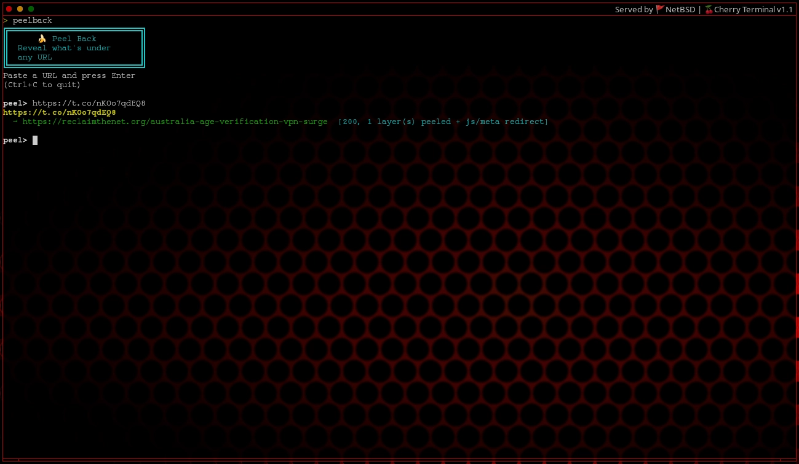

# 🍌 Peel Back

Peel Back is a lightweight Bash utility that reveals the true destination behind any URL by peeling away layers of redirects.

It follows both server-side redirects (HTTP 3xx responses) and client-side redirects such as:

- Meta refresh
- JavaScript window.location
- Canonical links
- OpenGraph og:url
- Title-based redirects (used by some services)

This makes it ideal for investigating shortened links, tracking redirects, or verifying where a link actually leads.

## Example

## Features

- Follow redirect chains to the final destination
- Peel multiple layers of redirects
- Detect soft redirects in HTML (meta, JavaScript, canonical tags)
- Verbose mode to display the entire redirect chain
- Show final response headers
- Batch processing via file input
- Pipe support (stdin input)
- JSON output for scripting or automation
- Fast and lightweight (Bash + curl only)

## Requirements

- Bash
- curl

Most Linux systems already include both.

If curl is missing:

boxforge install curl

## Installation

Option 1 — ScriptForge

scriptforge
/home/yourname/

Select peelback for installation to /usr/bin/peelback

Then run:

peelback https://example.com

Option 2 — Manual install

git clone https://github.com/fpucore/peelback.git
cd peelback
chmod +x peelback

Then run:

./peelback https://example.com

Option 3 — Run locally

chmod +x peelback
./peelback https://example.com

## Usage

peelback [OPTIONS] <url>

### Options

-v, --verbose        Show full redirect chain with status codes  
-f, --file <file>    Resolve URLs from a file  
-m, --max <num>      Maximum redirects to follow (default: 30)  
-t, --timeout <sec>  Connection timeout in seconds (default: 10)  
-H, --headers        Show response headers from the final destination  
-j, --json           Output results in JSON format  
-                    Read URLs from stdin  
-h, --help           Show help message  

## Examples

Resolve a shortened URL

peelback https://bit.ly/abc123

Example output:

https://bit.ly/abc123
  → https://example.com/article  [200, 3 layer(s) peeled]

Show the full redirect chain

peelback -v https://t.co/example

Example output:

Peeling: https://t.co/example

────────────────────────────────────────

Layer 0: [301] https://t.co/example
Layer 1: [302] https://example.org/redirect
Layer 2: [200] https://example.com/article

────────────────────────────────────────

Core URL:     https://example.com/article
Status Code:  200
Layers:       2

Resolve URLs from a file

urls.txt

https://bit.ly/abc
https://t.co/xyz
https://example.com

Run:

peelback -f urls.txt

Pipe URLs into Peel Back

echo "https://bit.ly/abc" | peelback -

or

cat urls.txt | peelback -

JSON output for scripts

peelback -j https://bit.ly/abc

Example output:

{
  "original":"https://bit.ly/abc",
  "resolved":"https://example.com/article",
  "status":200,
  "layers":3,
  "soft_redirect":false
}

Show final response headers

peelback -H https://bit.ly/abc

## How It Works

Peel Back uses curl to:

1. Follow HTTP redirects
2. Capture response headers and bodies
3. Detect client-side redirects embedded in HTML
4. Continue resolving until the true destination is reached

Soft redirects are detected using pattern matching for:

- meta refresh
- window.location
- og:url
- canonical
- redirect titles used by some services

## Use Cases

Peel Back is useful for:

- Investigating shortened URLs
- Verifying tracking links
- Auditing affiliate redirects
- Security research
- Automation scripts
- Understanding complex redirect chains

## License

MIT License

## Author

Chris McGimpsey-Jones  
chrismcgimpseyjones@duck.com